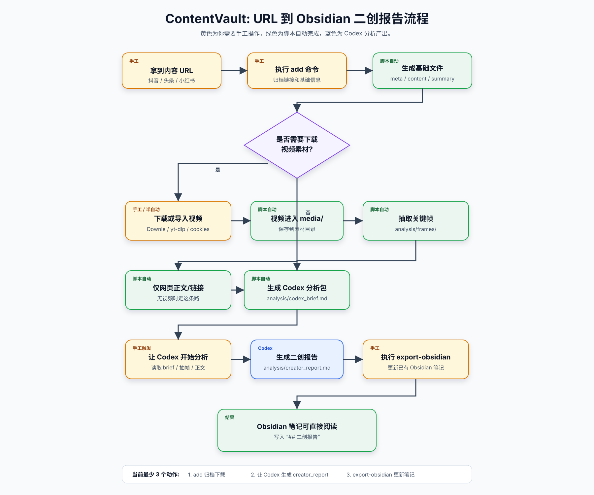

# ContentVault MVP

这是一个本地归档小工具：复制抖音、头条、小红书或普通网页链接后，把链接内容保存到本地，并生成一份方便二创的总结草稿。

当前版本偏稳妥：一天几个链接、手动运行、本地保存，不做批量抓取。

## 流程图



## 手工触发命令

当前从 URL 到 Obsidian 二创报告，最少需要手工触发 3 个动作。

### 1. 归档链接并下载视频

如果使用 Downie 4 下载并自动导入视频：

```bash
python3 -m content_mvp add "复制来的链接" --open-downie
```

如果使用 `yt-dlp` 下载视频：

```bash
python3 -m content_mvp add "复制来的链接" --download-media
```

抖音等平台经常需要浏览器登录态，可以加浏览器 cookies：

```bash
python3 -m content_mvp add "复制来的链接" --download-media --cookies-from-browser chrome
```

归档完成后会生成：

```text
data/YYYY-MM-DD/platform_slug/
```

如果视频已经进入 `media/`，工具会生成或刷新：

```text
analysis/frames/
analysis/codex_brief.md
```

### 2. 让 Codex 生成二创报告

把素材目录发给 Codex，让它基于 `analysis/codex_brief.md`、抽帧和正文生成最终报告：

```text
基于 data/YYYY-MM-DD/platform_slug/analysis/codex_brief.md 生成 creator_report.md
```

生成后文件位置是：

```text
data/YYYY-MM-DD/platform_slug/analysis/creator_report.md
```

### 3. 更新到 Obsidian

把最终二创报告同步到 Obsidian 对应素材笔记：

```bash
python3 -m content_mvp export-obsidian data/YYYY-MM-DD/platform_slug --vault "/Users/jianxiongyin/MacTools/Obsidian/本地纪事/14_ContentVault"
```

如果要更新某一天的所有素材：

```bash
python3 -m content_mvp export-obsidian data/YYYY-MM-DD --vault "/Users/jianxiongyin/MacTools/Obsidian/本地纪事/14_ContentVault"
```

导出时会优先按 `local_folder` / `source_url` 更新已有笔记，避免重复生成 `-2.md` 文件。

## NocoBase 集成

多人录入 URL 时，建议用 NocoBase 搭建两张表：

- `ai_url_submissions`: URL 收集和处理队列表。
- `ai_processed_assets`: 处理完成后的素材展示表。

详细字段设计见:

```text
docs/nocobase_integration.md
```

后端 job 处理完素材目录后，可以先生成要写回 `ai_processed_assets` 的 JSON:

```bash
python3 -m content_mvp nocobase-payload data/YYYY-MM-DD/platform_slug
```

也可以生成某一天的全部 payload:

```bash
python3 -m content_mvp nocobase-payload data/YYYY-MM-DD
```

如果 NocoBase 与 job 共用 MySQL，推荐 job 直接连库，并把调度交给 Prefect。当前默认数据库 block 名按下面约定:

```python
from prefect_sqlalchemy import SqlAlchemyConnector

database_block = SqlAlchemyConnector.load("local-mysql-3307")
```

初始 flow 骨架见:

```text
content_mvp/prefect_jobs.py
```

如果 Prefect worker 跑在这台有桌面会话的 Mac 上，可以让 flow 调起 Downie 4 并自动把下载结果导入当前素材目录:

```python
from content_mvp.prefect_jobs import process_pending_urls_flow

process_pending_urls_flow(limit=10, use_downie=True, downie_wait=180)
```

这条链路依赖本机 GUI 会话；如果 worker 跑在无头服务器上，Downie 方案就不适用。

你当前从 NocoBase 生成的默认表字段多是 `varchar(255)`，在接 job 前建议先执行或按需参考:

```text
docs/nocobase_mysql_migration.sql
```

## 快速开始

```bash
python3 -m content_mvp add "https://example.com/some-link"
```

归档会生成在：

```text
data/YYYY-MM-DD/platform_slug/
```

每条内容包含：

```text
meta.json       # 链接、平台、标题、摘要、图片/视频线索等元数据
content.md      # 提取出的正文和页面信息
summary.md      # 二创分析草稿
raw.html        # 原始 HTML，方便以后复查
media/          # 可选媒体下载目录
analysis/       # Codex 分析包和视频抽帧
```

## 常用命令

保存链接：

```bash
python3 -m content_mvp add "复制来的链接"
```

指定备注：

```bash
python3 -m content_mvp add "复制来的链接" --note "选题不错，适合做观点拆解"
```

尝试下载视频/图片媒体：

```bash
python3 -m content_mvp add "复制来的链接" --download-media
```

这个功能会优先调用本机的 `yt-dlp`。如果没有安装，会跳过并在 `meta.json` 里记录原因。
抖音等平台经常需要浏览器登录态，可以让 `yt-dlp` 读取本机浏览器 cookies：

```bash
python3 -m content_mvp add "复制来的链接" --download-media --cookies-from-browser chrome
```

Firefox 也可以指定：

```bash
python3 -m content_mvp add "复制来的链接" --download-media --cookies-from-browser firefox
```

如果你导出了 `cookies.txt`，也可以这样用：

```bash
python3 -m content_mvp add "复制来的链接" --download-media --cookies-file cookies.txt
```

如果终端设置了代理，但平台对代理环境比较敏感，可以关闭媒体下载代理：

```bash
python3 -m content_mvp add "复制来的链接" --download-media --cookies-from-browser firefox --no-media-proxy
```

如果本机安装了 Downie 4，也可以归档后把链接交给 Downie：

```bash
python3 -m content_mvp add "复制来的链接" --open-downie
```

默认会等待最多 180 秒，把 Downie 新下载到 `~/Downloads` 的视频复制到当前归档的 `media/` 目录。如果你只想打开 Downie，不想等待导入：

```bash
python3 -m content_mvp add "复制来的链接" --open-downie --downie-wait 0
```

尝试用浏览器渲染动态页面：

```bash
python3 -m content_mvp add "复制来的链接" --browser
```

这个功能需要本机已经安装 Python 版 Playwright。动态平台页面经常需要登录，本工具只做本地个人归档，不绕过平台权限。

对已经归档的素材生成二创分析包：

```bash
python3 -m content_mvp analyze data/2026-05-14/douyin_xxx
```

也可以直接分析某一天的所有素材，并同步导出到 Obsidian：

```bash
python3 -m content_mvp analyze data/2026-05-14 --export-obsidian "/Users/jianxiongyin/MacTools/Obsidian/本地纪事/14_ContentVault"
```

如果素材目录里有本地视频，`analyze` 会用 `ffmpeg` 抽取关键帧到 `analysis/frames/`，并生成 `analysis/codex_brief.md`。这份文件包含标题、链接、本地视频路径、抽帧画面和给 Codex 的分析任务，方便继续做剧情拆解、爆点提炼、标题和口播脚本。

可选增强依赖：

```bash
python3 -m pip install -r requirements-optional.txt
python3 -m playwright install chromium
```

## 输出用途

`summary.md` 会给你一份二创起点：

- 一句话总结
- 核心信息
- 可能的爆点
- 可二创角度
- 标题方向
- 风险提醒
- 改写脚本骨架

后续可以接入更强的模型总结、语音转文字、剪贴板监听和本地数据库。
