# ContentVault MVP

ContentVault 用来把同事发现的内容 URL 自动归档成可预览、可下载、可分析的素材记录。

当前主流程已经切到全自动化:

1. 同事在 NocoBase 录入 URL。
2. URL 进入 `ai_url_submissions`。
3. Prefect 按计划拉取待处理记录。
4. 本地 job 归档页面、调起 Downie 下载视频、生成分析包。
5. 结果写回 `ai_processed_assets`，供相关人员在 NocoBase 里查看。

## 全自动化流程



Mermaid 源文件和文字版说明:

```text
docs/contentvault_automation_flow.mmd
docs/contentvault_automation_flow.md
```

## NocoBase 集成

当前使用两张表:

- `ai_url_submissions`: URL 收集和处理队列表。
- `ai_processed_assets`: 处理完成后的素材展示表。

详细字段设计见:

```text
docs/nocobase_integration.md
```

数据库通过 Prefect block 直连:

```python
from prefect_sqlalchemy import SqlAlchemyConnector

database_block = SqlAlchemyConnector.load("local-mysql-3307")
```

如果需要查看当前 schema 的后续可选优化，可参考:

```text
docs/nocobase_mysql_migration.sql
```

## Prefect Flow

主 flow 位于:

```text
content_mvp/prefect_jobs.py
```

本地手工触发一次:

```bash
arch -arm64 python3 -c "from content_mvp.prefect_jobs import process_pending_urls_flow; print(process_pending_urls_flow(limit=1, use_downie=True, downie_wait=180))"
```

典型状态流:

```text
pending -> processing -> succeeded
                         -> failed
```

Downie 自动下载链路:

```text
archive_link
-> open Downie 4
-> wait for ~/Downloads
-> import media/
-> analyze_item
-> upsert ai_processed_assets
```

运行限制: Downie 4 是 GUI 应用，所以 Prefect worker 必须运行在同一台有图形会话的 Mac 上，并且当前会话能够调起 `Downie 4.app`。如果未来 worker 迁移到远程 Linux 或无头会话，这条 Downie 自动下载链路将不可用，需要改用别的下载方案。

## 本地归档结构

每条内容会生成:

```text
data/YYYY-MM-DD/platform_slug/
  meta.json
  content.md
  summary.md
  raw.html
  media/
  analysis/
    codex_brief.md
    frames/
```

## 调试命令

这些命令主要用于单条排查或本地手工补录，不是现在的主生产链路。

手工归档一个 URL:

```bash
python3 -m content_mvp add "https://example.com/some-link"
```

手工归档并把链接交给 Downie:

```bash
python3 -m content_mvp add "复制来的链接" --open-downie
```

重新分析已有素材:

```bash
python3 -m content_mvp analyze data/YYYY-MM-DD/platform_slug
```

查看归档内容:

```bash
python3 -m content_mvp inspect data/YYYY-MM-DD
```

生成展示表 payload:

```bash
python3 -m content_mvp nocobase-payload data/YYYY-MM-DD/platform_slug
```

导出到 Obsidian:

```bash
python3 -m content_mvp export-obsidian data/YYYY-MM-DD --vault "/Users/jianxiongyin/MacTools/Obsidian/本地纪事/14_ContentVault"
```

## 可选依赖

```bash
python3 -m pip install -r requirements-optional.txt
python3 -m playwright install chromium
```

当前可选依赖用途:

- `yt-dlp`: 非 Downie 路径下的媒体下载尝试。
- `playwright`: 动态页面渲染。
- `prefect` / `prefect-sqlalchemy` / `pymysql`: 数据库 job 和调度。
