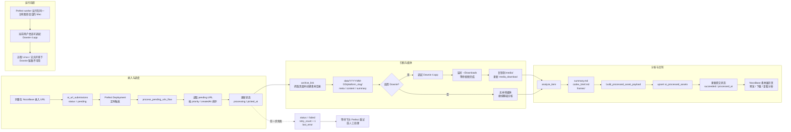

# ContentVault 全自动化流程图



## 文字版

### 1. 录入 URL

同事在 NocoBase 中录入内容 URL。录入后，NocoBase 将这条记录写入 `ai_url_submissions`，初始状态为 `pending`。

### 2. Prefect 定时拉取任务

Prefect deployment 按计划触发 `process_pending_urls_flow`。flow 从 `ai_url_submissions` 中读取 `pending` 记录，并按 `priority`、`createdAt` 排序，先处理优先级高且更早进入队列的任务。

### 3. 标记开始处理

flow 将当前记录更新为:

```text
status = processing
picked_at = now
```

这样 NocoBase 页面可以直接看到该 URL 已经进入处理阶段。

### 4. 归档页面内容

flow 调用 `archive_link`，抓取原始页面并创建本地素材目录:

```text
data/YYYY-MM-DD/platform_slug/
```

归档后先生成基础文件:

```text
meta.json
content.md
summary.md
raw.html
```

### 5. 判断是否启用 Downie 自动下载

如果本次 flow 参数启用了 `use_downie=True`，则继续走媒体下载链路；如果没有启用，则跳过本地媒体导入，直接进入基础分析。

### 6. 调起 Downie 并导入视频

在启用 Downie 的情况下，flow 会:

1. 调起 `Downie 4.app`
2. 监听 `~/Downloads`
3. 等待新视频下载完成
4. 将下载好的视频复制到当前素材目录的 `media/`
5. 更新 `meta.json.media_download`

### 7. 生成分析产物

无论是否拿到本地视频，flow 都会执行 `analyze_item`。如果有视频，会额外抽取关键帧。

生成结果:

```text
summary.md
analysis/codex_brief.md
analysis/frames/
```

### 8. 组装展示表 payload

flow 调用 `build_processed_asset_payload`，把标题、平台、原链接、本地路径、媒体路径、分析文本等内容整理成适合写入数据库的 payload。

### 9. 写入结果展示表

flow 将 payload upsert 到 `ai_processed_assets`。这张表是 NocoBase 素材展示页的数据来源，相关人员后续会在这里查看:

- 标题
- 平台
- 视频路径
- 下载状态
- 分析状态
- 摘要和二创分析内容

### 10. 标记处理成功

写入展示表后，flow 会把 `ai_url_submissions` 中对应记录更新为:

```text
status = succeeded
processed_at = now
```

### 11. 展示给相关人员

NocoBase 素材展示页读取 `ai_processed_assets`，供相关人员预览、下载和查看分析结果。

### 12. 失败分支

如果任一步失败，flow 会回写:

```text
status = failed
retry_count = retry_count + 1
last_error = <错误信息>
```

随后等待下一次 Prefect 重试，或由人工介入处理。

### 13. 运行前提

Downie 4 是 GUI 应用，所以启用自动下载时还要求:

- Prefect worker 运行在同一台有图形会话的 Mac 上。
- 当前用户会话可以调起 `Downie 4.app`。
- Downie 下载目录与 flow 的 `downloads_dir` 参数一致，默认是 `~/Downloads`。
- 如果未来 worker 迁移到远程 Linux 或无头会话，Downie 自动下载链路将不可用，需要换成其他下载方案。
