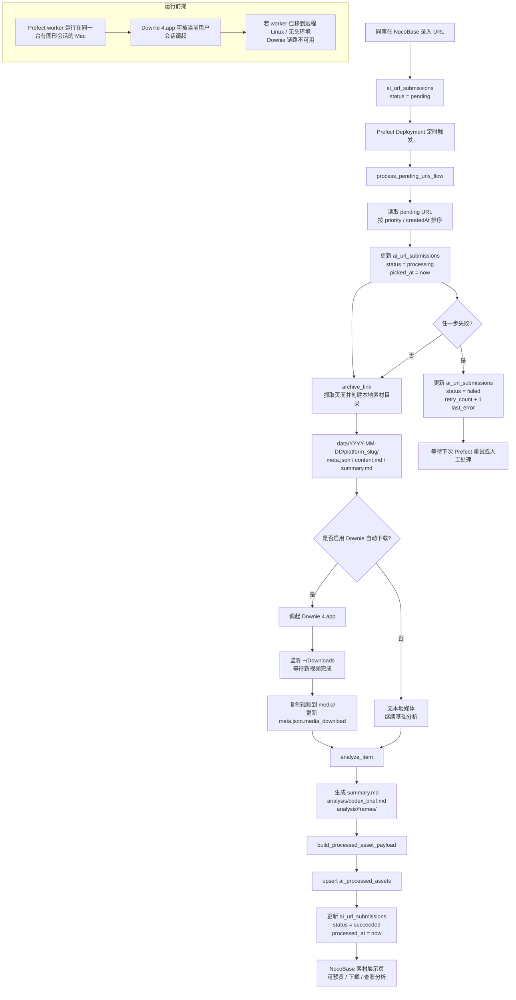

# ContentVault 全自动化流程图

## 文字版

1. 同事在 NocoBase 录入 URL。
2. URL 写入 `ai_url_submissions`，初始状态为 `pending`。
3. Prefect deployment 按计划触发 flow。
4. flow 拉取待处理 URL，先把状态改成 `processing`。
5. 本地创建素材目录并归档页面内容。
6. 如果开启 Downie 自动下载，则调起 `Downie 4.app`，等待视频下载完成后导入到当前素材目录的 `media/`。
7. 执行 `analyze_item`，生成摘要、Codex 分析包和关键帧。
8. 生成展示表 payload，并 upsert 到 `ai_processed_assets`。
9. 将 URL 收集表状态改成 `succeeded`。
10. 相关人员在 NocoBase 素材展示页预览、下载和查看分析结果。
11. 任一步失败则回写 `failed`、`retry_count` 和 `last_error`，等待后续重试。
